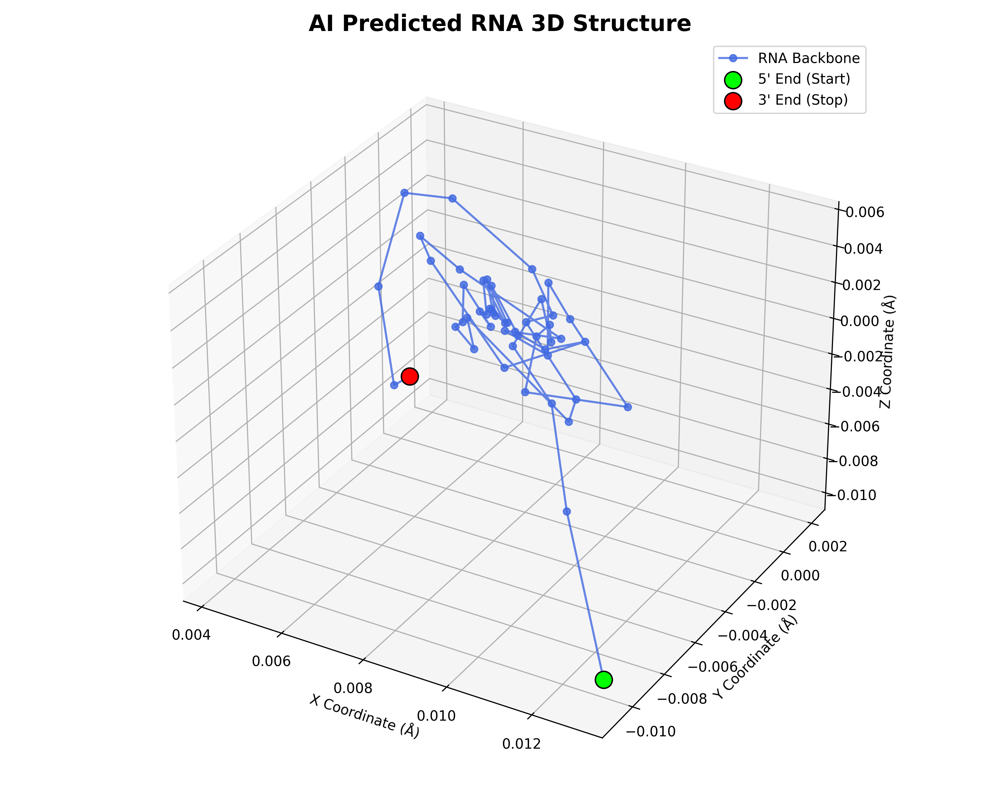

# RNA Structure Prediction with Deep Learning

A deep learning project for predicting RNA chemical reactivity and 3D spatial structure, built for the [Stanford Ribonanza RNA Folding](https://www.kaggle.com/competitions/stanford-ribonanza-rna-folding) Kaggle competition.



## Motivation

RNA molecules fold into complex 3D structures that determine their biological function. Accurately predicting these structures from sequence alone remains an open challenge in computational biology. This project explores deep learning approaches to two related problems:

1. **Reactivity Prediction**: Predicting per-nucleotide chemical reactivity values (2A3_MaP and DMS_MaP) that serve as proxies for RNA flexibility and accessibility.
2. **3D Coordinate Prediction**: Predicting the spatial (x, y, z) coordinates of each nucleotide in a folded RNA molecule.

## Architecture

### Reactivity Model (Competition Entry)

```
Input (7-dim)  →  CNN (2-layer + BatchNorm)  →  Bi-LSTM  →  Transformer Encoder  →  Output (2-dim)
  ↑                                                ↑              ↑                      ↑
ACGU + 2D         Local motif               Sequential       Self-attention         2A3 & DMS
structure         extraction               context (both     for long-range        reactivity
from ViennaRNA                             directions)       base interactions
```

**Input features (7 dimensions per nucleotide)**:
- 4 dims: One-hot encoded sequence (A, C, G, U)
- 3 dims: One-hot encoded secondary structure from ViennaRNA MFE (`(`, `)`, `.`)

**Key design choices**:
| Decision | Rationale |
|----------|-----------|
| Dual-layer CNN + BatchNorm | Feature hierarchy: primitive patterns → higher-order motifs |
| Bi-LSTM before Transformer | Implicit positional encoding; captures sequential dependencies |
| Transformer residual connection | Stabilises early training; model can fall back to LSTM features |
| L1 Loss (MAE) over MSE | More robust to outlier reactivity values in the dataset |
| Clamp targets only (not predictions) | Avoids gradient vanishing — [see debugging story below](#debugging-gradient-vanishing) |

### 3D Structure Model

A simpler CNN + Bi-LSTM architecture that maps one-hot encoded sequences directly to (x, y, z) coordinates per nucleotide.

## Project Structure

```
RNA_RL_bioresearch/
├── README.md                  ← This file
├── requirements.txt           ← Python dependencies
├── .gitignore
│
├── src/                       ← Core source code
│   ├── data_pipeline_3d.py    ← PyTorch Dataset for 3D coordinate data
│   ├── model_3d.py            ← CNN + Bi-LSTM model architecture
│   ├── train_3d.py            ← Training pipeline with masked loss
│   └── inference_3d.py        ← Inference + 3D visualisation
│
├── kaggle/                    ← Kaggle competition code
│   ├── kaggle_training_script.py  ← Self-contained training script (GPU)
│   └── download_data.sh       ← Dataset download helper
│
├── notebooks/                 ← Exploratory analysis
│   └── 01_data_exploration.py ← EDA: sequence distributions, reactivity patterns
│
├── experiments/               ← Training logs and experiment records
│   └── experiment_notes.md    ← Hyperparameter tuning log
│
├── results/                   ← Output visualisations
│   └── predicted_rna_3d.png   ← 3D structure prediction example
│
└── docs/                      ← Development documentation
    └── learning_journal.md    ← Learning process and reflections
```

## Getting Started

### Prerequisites

```bash
pip install -r requirements.txt
```

### Quick Test (Local, CPU)

```bash
# Test the 3D prediction pipeline with synthetic data
cd src/
python train_3d.py

# Run inference and generate a 3D visualisation
python inference_3d.py
```

### Full Training (Kaggle GPU)

1. Upload `kaggle/kaggle_training_script.py` to a Kaggle Notebook
2. Attach the [Stanford Ribonanza RNA Folding](https://www.kaggle.com/competitions/stanford-ribonanza-rna-folding) dataset
3. Enable GPU acceleration (P100 or T4)
4. Run all cells — training takes ~2 hours for 50 epochs

## Debugging: Gradient Vanishing

During training, I observed that the model's loss stopped decreasing after a few epochs. After investigation, I identified the root cause in the loss computation:

```python
# BUG: clamping predictions kills gradients outside [0, 1]
preds_clipped = torch.clamp(predictions, 0.0, 1.0)   # ← gradient = 0 when pred > 1 or pred < 0
loss = criterion(preds_clipped, targets_clipped)

# FIX: only clamp targets, keep raw predictions for gradient flow
reacts_clipped = torch.clamp(reactivities, 0.0, 1.0)
loss = criterion(predictions, reacts_clipped)          # ← full gradient preserved
```

**Why this matters**: When `torch.clamp` is applied to predictions, any predicted value outside `[0, 1]` gets a gradient of exactly zero. The model cannot learn to pull those predictions back into range, causing training to stall. The fix is to only clamp the target values, allowing the L1 loss to produce non-zero gradients for all predictions.

This distinction between training loss (unclamped predictions) and evaluation metric (clamped predictions) is a subtle but critical detail in competition ML.

## Experiment Log

| Version | Architecture | Train Loss | CV Loss | Key Change |
|---------|-------------|------------|---------|------------|
| v1 | CNN + Bi-LSTM + Transformer | — | — | Baseline with 4-dim input |
| v2 | + ViennaRNA 2D structure | — | — | 7-dim input, dual-CNN + BatchNorm |
| v3 | + Residual connection | — | — | Fix gradient vanishing, Transformer residual |

*See [experiments/experiment_notes.md](experiments/experiment_notes.md) for detailed training logs.*

## Learning Journey

This project represents my first end-to-end deep learning project applied to a real bioinformatics problem. I started from foundational ML concepts and progressively built up to a competition-grade model. Key learning milestones:

1. **Data Engineering**: Learned to handle variable-length biological sequences with padding and masking
2. **Architecture Design**: Understood why hybrid architectures (CNN → LSTM → Transformer) outperform single-model approaches for sequence data
3. **Debugging ML Models**: Discovered and fixed a gradient vanishing bug caused by incorrect loss clamping
4. **Competition ML**: Learned the importance of aligning training loss with evaluation metrics

See [docs/learning_journal.md](docs/learning_journal.md) for a more detailed reflection.

## Future Directions

- [ ] Explore Graph Neural Networks (GNN) to directly model base-pairing interactions
- [ ] Investigate SE(3)-equivariant architectures for physically consistent 3D predictions
- [ ] Implement attention visualisation to interpret what the model learns about RNA structure
- [ ] Add data augmentation (reverse complement, noise injection) for better generalisation

## References

- Stanford Ribonanza RNA Folding Competition: https://www.kaggle.com/competitions/stanford-ribonanza-rna-folding
- ViennaRNA Package: https://www.tbi.univie.ac.at/RNA/
- Lorenz et al. (2011). "ViennaRNA Package 2.0." *Algorithms for Molecular Biology*, 6(1), 26.

## License

This project is for educational and research purposes.
