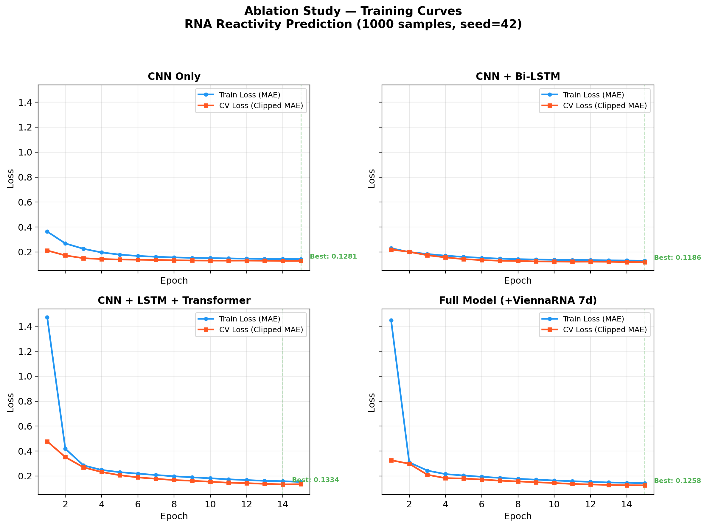

# RNA Structure Prediction with Deep Learning

# RNA_RL_bioresearch

*Note: In the context of this project, "RL" stands for **Representation Learning**, focusing on learning meaningful representations of RNA sequences, not Reinforcement Learning.*

Deep learning models for predicting RNA structure and reactivity. This project was developed as a learning journey and applied to the [Stanford Ribonanza RNA Folding Competition](https://www.kaggle.com/competitions/stanford-ribonanza-rna-folding).

## Motivation

RNA molecules fold into complex 3D structures that determine their biological function. Accurately predicting these structures from sequence alone remains an open challenge in computational biology. This project explores deep learning approaches to two related problems:

1. **Reactivity Prediction**: Predicting per-nucleotide chemical reactivity values (2A3_MaP and DMS_MaP) that serve as proxies for RNA flexibility and accessibility.
2. **3D Coordinate Prediction**: Predicting the spatial (x, y, z) coordinates of each nucleotide in a folded RNA molecule.

## Architecture

### Reactivity Model (Competition Entry)

```
Input (7-dim)  →  CNN (2-layer + BatchNorm)  →  Bi-LSTM  →  Transformer Encoder  →  Output (2-dim)
  ↑                                                ↑              ↑                      ↑
ACGU + 2D         Local motif               Sequential       Self-attention         2A3 & DMS
structure         extraction               context (both     for long-range        reactivity
from ViennaRNA                             directions)       base interactions
```

**Input features (7 dimensions per nucleotide)**:
- 4 dims: One-hot encoded sequence (A, C, G, U)
- 3 dims: One-hot encoded secondary structure from ViennaRNA MFE (`(`, `)`, `.`)

**Key design choices**:
| Decision | Rationale |
|----------|-----------|
| Dual-layer CNN + BatchNorm | Feature hierarchy: primitive patterns → higher-order motifs |
| Bi-LSTM before Transformer | Implicit positional encoding; captures sequential dependencies |
| Transformer residual connection | Stabilises early training; model can fall back to LSTM features |
| L1 Loss (MAE) over MSE | More robust to outlier reactivity values in the dataset |
| Clamp targets only (not predictions) | Avoids gradient vanishing — [see debugging story below](#debugging-gradient-vanishing) |

### 3D Structure Model

A simpler CNN + Bi-LSTM architecture that maps one-hot encoded sequences directly to (x, y, z) coordinates per nucleotide.

## Project Structure

```
RNA_RL_bioresearch/
├── README.md                  ← This file
├── requirements.txt           ← Python dependencies
├── .gitignore
│
├── src/                       ← Core source code (modular, importable)
│   ├── __init__.py
│   ├── model_reactivity.py    ← Reactivity model variants (ablation)
│   ├── data_pipeline_reactivity.py ← Dataset for reactivity prediction
│   ├── model_3d.py            ← CNN + Bi-LSTM for 3D coordinates
│   ├── data_pipeline_3d.py    ← Dataset for 3D coordinate data
│   ├── train_3d.py            ← 3D training pipeline with masked loss
│   └── inference_3d.py        ← Inference + 3D visualisation
│
├── kaggle/                    ← Kaggle competition code (self-contained)
│   ├── kaggle_training_script.py   ← Reactivity model (merged for Kaggle Notebook)
│   ├── kaggle_3d_training_script.py ← 3D model (merged for Kaggle Notebook)
│   └── download_data.sh       ← Dataset download helper
│
├── experiments/               ← Experiment scripts and logs
│   ├── run_ablation.py        ← Ablation study (4 model variants)
│   ├── plot_results.py        ← Training curves + attention heatmap
│   ├── experiment_notes.md    ← Hyperparameter tuning log
│   ├── ablation_results.csv   ← Per-epoch loss data (generated)
│   └── ablation_summary.csv   ← Summary table (generated)
│
├── notebooks/                 ← Exploratory analysis
│   └── 01_data_exploration.py ← EDA: distributions, reactivity patterns
│
├── results/                   ← Output visualisations (generated)
│   └── training_curves.png    ← Loss vs. epoch for all variants
│
└── docs/                      ← Development documentation
    └── learning_journal.md    ← Learning process and reflections
```

## Getting Started

### Prerequisites

```bash
pip install -r requirements.txt
```

### Quick Test (Local, CPU)

```bash
# Test the 3D prediction pipeline with synthetic data
cd src/
python train_3d.py

# Run inference and generate a 3D visualisation
python inference_3d.py
```

### Full Training (Kaggle GPU)

1. Upload `kaggle/kaggle_training_script.py` to a Kaggle Notebook
2. Attach the [Stanford Ribonanza RNA Folding](https://www.kaggle.com/competitions/stanford-ribonanza-rna-folding) dataset
3. Enable GPU acceleration (P100 or T4)
4. Run all cells — training takes ~2 hours for 50 epochs

## Debugging: Gradient Vanishing

During training, I observed that the model's loss stopped decreasing after a few epochs. After investigation, I identified the root cause in the loss computation:

```python
# BUG: clamping predictions kills gradients outside [0, 1]
preds_clipped = torch.clamp(predictions, 0.0, 1.0)   # ← gradient = 0 when pred > 1 or pred < 0
loss = criterion(preds_clipped, targets_clipped)

# FIX: only clamp targets, keep raw predictions for gradient flow
reacts_clipped = torch.clamp(reactivities, 0.0, 1.0)
loss = criterion(predictions, reacts_clipped)          # ← full gradient preserved
```

**Why this matters**: When `torch.clamp` is applied to predictions, any predicted value outside `[0, 1]` gets a gradient of exactly zero. The model cannot learn to pull those predictions back into range, causing training to stall. The fix is to only clamp the target values, allowing the L1 loss to produce non-zero gradients for all predictions.

This distinction between training loss (unclamped predictions) and evaluation metric (clamped predictions) is a subtle but critical detail in competition ML.

## Ablation Study

A systematic ablation study quantifies the contribution of each architectural component. All variants were trained under identical conditions (seed=42, 15 epochs, 1000 samples, L1 loss with target-only clamping).

| Variant | Parameters | Best CV Loss (Clipped MAE) | Best Epoch | Training Time |
|---------|-----------|---------------------------|------------|---------------|
| CNN Only | 43,074 | 0.1281 | 15 | 19s |
| CNN + Bi-LSTM | 702,786 | **0.1186** | 15 | 85s |
| CNN + LSTM + Transformer | 2,282,306 | 0.1334 | 14 | 363s |
| Full Model (+ ViennaRNA 7d) | 2,283,266 | 0.1258 | 15 | 363s |

**Key findings**:
1. **CNN + Bi-LSTM achieves the lowest CV loss** (0.1186), outperforming the more complex Transformer variants on this small dataset.
2. Adding the Transformer (+1.6M parameters) **increases** CV loss from 0.1186 → 0.1334 — a clear sign of overfitting on 1000 samples.
3. Adding the 7D structure features via ViennaRNA **improves** the Transformer variant's performance (CV loss reduced from 0.1334 to 0.1258). This demonstrates that structural representation provides a valuable inductive bias, though it is still outperformed by the simpler Bi-LSTM model on this dataset size.
4. The Transformer variants show much higher initial loss (1.47 vs. 0.36), indicating slower convergence due to the self-attention warm-up period.

**Interpretation**: Transformer self-attention is most effective when the dataset is large enough to learn meaningful long-range interaction patterns. With only 1000 samples, the Bi-LSTM's inductive bias (sequential processing) provides a stronger prior than the Transformer's more general attention mechanism. However, integrating explicitly computed secondary structures (ViennaRNA) provides a measurable benefit to complex models. This aligns with the observation that RNA folding is inherently sequential — the 5'→3' synthesis order constrains which structures can form.

These historical scores used a row-level random split. The current training code
uses a sequence-grouped split to prevent the same RNA sequence (for example under
different experimental conditions) from appearing in both training and validation.
The grouped scores must be regenerated before making a generalisation claim.

*To reproduce: first run `bash kaggle/download_data.sh`, then
`python experiments/run_ablation.py --max-samples 1000` (seed=42).*

The reported ViennaRNA gain is a controlled comparison within the Transformer
architecture (0.1334 → 0.1258 clipped MAE). It does not make the ViennaRNA model
the overall winner: CNN + Bi-LSTM remains best in this historical run at 0.1186.

*See [experiments/experiment_notes.md](experiments/experiment_notes.md) for detailed hyperparameter tuning history.*

### Training Curves



The CNN-only and CNN+LSTM variants converge smoothly from epoch 1, while the Transformer variants require several epochs to escape a high-loss initialisation phase. All variants show healthy train-CV convergence without significant overfitting gaps.


## Learning Journey

This project represents my first end-to-end deep learning project applied to a real bioinformatics problem. I started from foundational ML concepts and progressively built up to a competition-grade model. Key learning milestones:

1. **Data Engineering**: Learned to handle variable-length biological sequences with padding and masking
2. **Architecture Design**: Understood why hybrid architectures (CNN → LSTM → Transformer) outperform single-model approaches for sequence data — and also learned that **more complex ≠ better** when data is limited
3. **Debugging ML Models**: Discovered and fixed a gradient vanishing bug caused by incorrect loss clamping
4. **Systematic Evaluation**: Designed and executed an ablation study to quantify the contribution of each component
5. **Competition ML**: Learned the importance of aligning training loss with evaluation metrics

See [docs/learning_journal.md](docs/learning_journal.md) for a more detailed reflection.

## Reproducibility

All experiments use fixed random seeds for reproducible results:

```python
SEED = 42
torch.manual_seed(SEED)
np.random.seed(SEED)
```

To reproduce the full ablation study:
```bash
pip install -r requirements.txt
python experiments/run_ablation.py    # Train all variants (~14 min, CPU)
python experiments/plot_results.py    # Generate visualisations
```

## Future Directions

- [ ] **Scale to full Kaggle dataset** (~50k samples) to test whether the Transformer advantage emerges at scale — the ablation study suggests it needs more data
- [ ] Explore **Graph Neural Networks** (GNN) to directly model base-pairing interactions, following Joshi et al. (2023) on RNA structure prediction with GNNs
- [ ] Investigate **SE(3)-equivariant architectures** for physically consistent 3D predictions, inspired by Townshend et al. (2021) geometric deep learning for RNA
- [ ] **Multi-task learning**: jointly predict reactivity and secondary structure, testing the hypothesis that 2D structure as an auxiliary task provides useful inductive bias
- [ ] Add data augmentation (reverse complement, noise injection) for better generalisation

## References

- Stanford Ribonanza RNA Folding Competition: https://www.kaggle.com/competitions/stanford-ribonanza-rna-folding
- ViennaRNA Package: https://www.tbi.univie.ac.at/RNA/
- Lorenz et al. (2011). "ViennaRNA Package 2.0." *Algorithms for Molecular Biology*, 6(1), 26.
- Vaswani et al. (2017). "Attention Is All You Need." *NeurIPS*.
- Townshend et al. (2021). "Geometric deep learning of RNA structure." *Science*, 373(6558), 1047-1051.

## License

This project is for educational and research purposes.
